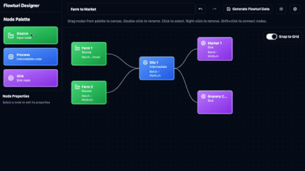

# Flowturi Designer

A visual editor for [Flowturi](https://github.com/ThatOrJohn/flowturi) Sankey diagrams.

## Demo



## Features

- Interactive node/link editing
- Optional process type/relative volume property assignment
- Export Flowturi animation file

## Getting Started

```bash
npm install
npm run dev
```

## Future Work

- Node/link layout export
- Alert thresholds
- Integration with Flowturi Studio
